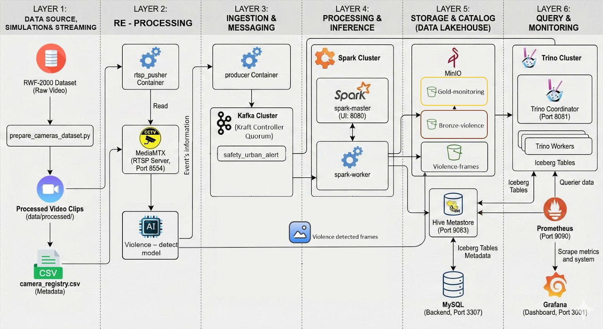
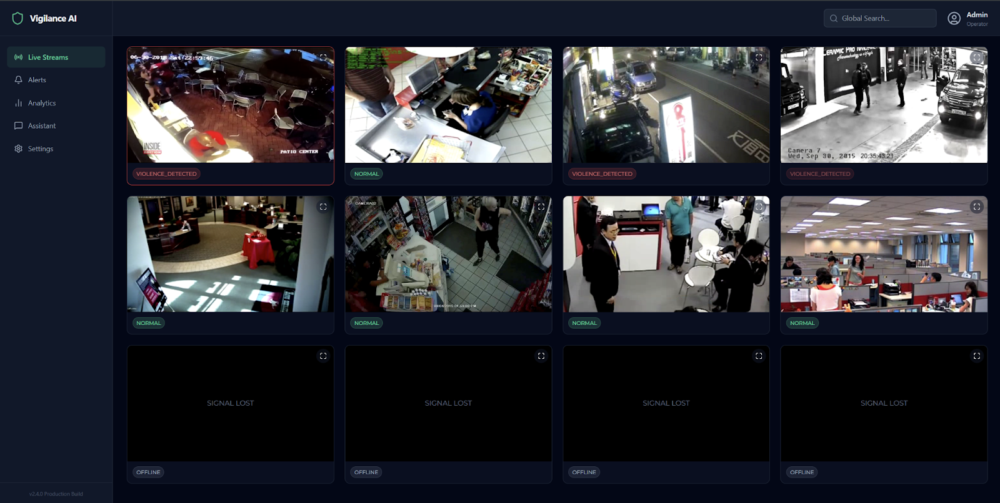
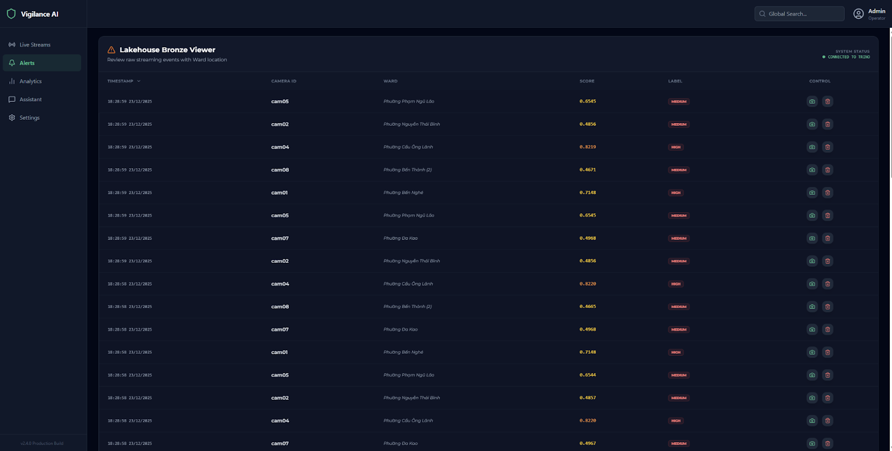
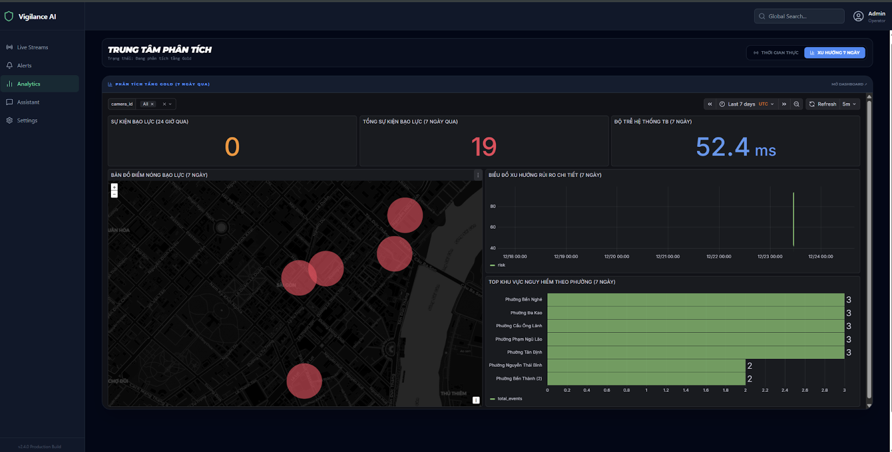
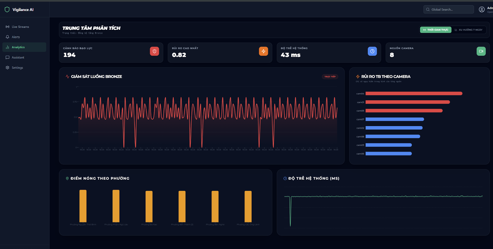
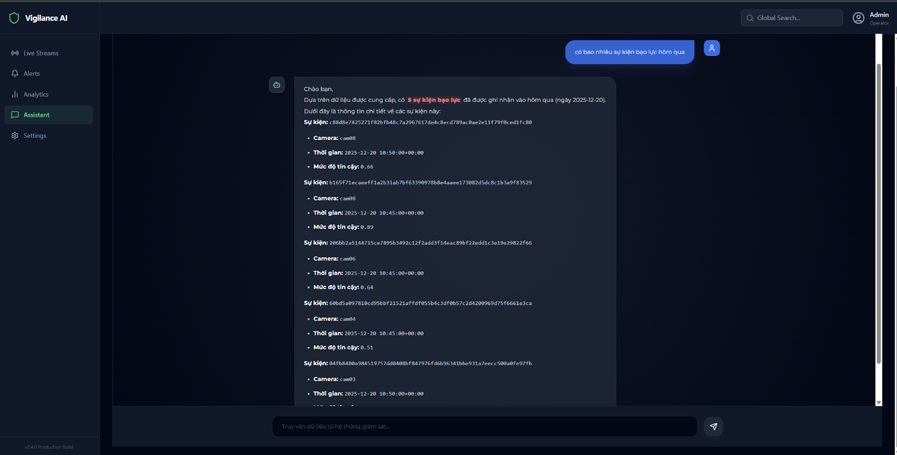
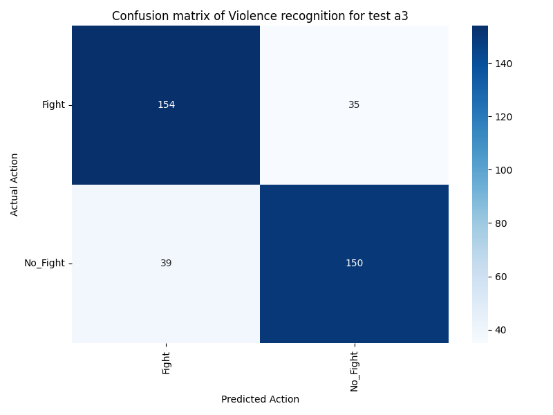
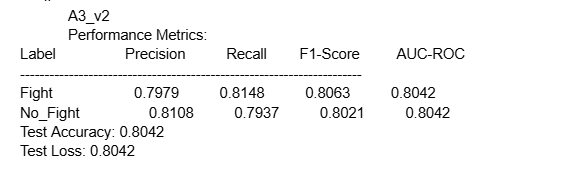

# 🛡️ Smart Security Monitoring System based on Lakehouse & AI

### End-to-End Real-time Violence Detection & Analytics Platform

## 📖 Introduction

This project implements an enterprise-grade **Real-time Security Monitoring System** designed to assist local authorities in maintaining public safety. Unlike traditional passive CCTV systems, this solution proactively detects violent behaviors (fighting, assaults) in real-time using Deep Learning and provides actionable insights through a modern **Data Lakehouse** architecture.

The system integrates edge AI for immediate inference, a streaming data pipeline for low-latency alerts, and a Generative AI assistant (RAG) to query security events using natural language.

## 🚀 Key Features

* **Real-time Violence Detection:** Deploys **VioMobileNet** (MobileNetV2 + Bi-LSTM) to detect violence in video streams with high accuracy (>80%).
* **Modern Data Lakehouse:** Built on **Apache Iceberg** and **MinIO**, supporting ACID transactions, Schema Evolution, and Time Travel for forensic analysis.
* **Medallion Architecture (ELT):**
* **Bronze Layer:** Raw telemetry and inference metadata ingestion via Spark Structured Streaming.
* **Gold Layer:** Aggregated analytical data (Star Schema) for trend analysis.


* **Dual-Pipeline Inference:** Innovative priority-based resource orchestration ensuring real-time latency even under heavy load.
* **GenAI Assistant (RAG):** An AI terminal powered by **Google Gemini** and **ChromaDB** that allows users to ask questions like *"Any violent incidents in District 1 last night?"* and receive grounded answers.

## 🏗️ System Architecture


**Layer 1: Data Source**

* **RWF-2000 Dataset:** Source of real-world violence videos for simulation.
* **RTSP Simulation:** Generates multi-camera streams to test system load.

**Layer 2: Edge Inference**

* **MediaMTX:** Low-latency RTSP server for stream management.
* **VioMobileNet:** Hybrid MobileNetV2 + Bi-LSTM model for real-time violence detection.

**Layer 3: Message Broker**

* **Apache Kafka:** Buffers metadata to decouple inference from storage.

**Layer 4: Lakehouse Storage**

* **Apache Spark:** Handles real-time ingestion (Streaming) and ETL (Batch).
* **Apache Iceberg:** Provides ACID transactions and schema enforcement for the Data Lake.

**Layer 5: Analytics Engine**

* **MinIO:** S3-compatible object storage.
* **Trino:** Distributed SQL engine for high-speed queries on Iceberg tables.

**Layer 6: Interaction & GenAI**

* **Visualizations:** Grafana for metrics; React for the Command Center.
* **RAG Assistant:** Gemini API + ChromaDB for natural language security queries.

## 🖥️ User Interface Showcase

The application is designed as a **Single Page Application (SPA)** using React.js and Tailwind CSS, focusing on a "Dark Mode" high-contrast experience for 24/7 operation centers.

### 1. Live Command Center

The central hub for operators, displaying multi-camera grids with **<100ms latency**.

* **Instant Visual Feedback:** Camera borders automatically change color based on real-time risk scores: **Green** (Normal), **Yellow** (Warning), and **Red/Flashing** (Violence Detected).
* **Technical Overlay:** Displays real-time FPS, Latency, and AI Confidence Scores directly on the video stream.

### 2. Lakehouse Bronze Viewer (Raw Alerts)

A direct interface to the **Apache Iceberg Bronze Layer**, allowing operators to monitor the raw data stream.

* **Data Integrity:** Auto-refreshes to show incoming metadata (Timestamp, Camera ID, Risk Score).
* **Evidence Playback:** One-click access to snapshot evidence stored in MinIO.
* **False Positive Management:** Operators can perform "Soft Deletes" on incorrect alerts, cleaning the dataset before it moves to the Gold Layer.

### 3. Multi-layer Analytics Dashboard



Visualizes data aggregated in the **Gold Layer** (Star Schema) for strategic decision-making.

* **Real-time Waveform:** Visualizes the "heartbeat" of the system and risk spikes.
* **Geospatial Heatmap:** Maps crime hotspots across city wards using red heat layers for quick identification of dangerous zones.
* **Trend Analysis:** Displays 7-day historical trends and ranks the top dangerous areas to assist in patrol planning.

### 4. Vigilance Intelligence Terminal (GenAI Assistant)

A natural language interface powered by **Google Gemini** and **RAG (Retrieval-Augmented Generation)**.

* **Natural Language Queries:** Allows users to ask questions like *"How many violent events occurred in Ben Nghe Ward yesterday?"*.
* **Grounded Answers:** Responses are generated solely from the Lakehouse data, with direct citations to specific event IDs to prevent hallucinations.

## 🛠️ Tech Stack

### Big Data & Infrastructure

* **Streaming:** Apache Kafka (KRaft mode)
* **Processing:** Apache Spark (Structured Streaming & Batch)
* **Storage & Format:** MinIO (Object Storage), Apache Iceberg (Table Format)
* **Query Engine:** Trino (PrestoSQL)
* **Containerization:** Docker, Docker Compose

### Artificial Intelligence

* **Core Model:** VioMobileNet (Transfer learning from MoViNet/MobileNetV2)
* **Frameworks:** TensorFlow/Keras, OpenCV
* **GenAI / LLM:** Google Gemini API
* **Vector DB:** ChromaDB (for RAG)

### Application & Monitoring

* **Frontend:** React.js, Tailwind CSS
* **Monitoring:** Prometheus, Grafana
* **Backend API:** Python Microservices

## 🧠 AI Model Performance

We developed **VioMobileNet**, a hybrid architecture optimized for edge devices.

* **Optimization:** Employed "Boost & Drop" logic for non-linear post-processing to reduce false positives.
* **Best Model (A3):**
* **Accuracy:** ~80% on Test Set.
* **Inference Speed:** 12 FPS stable on simulated edge environment.
* **Latency:** Average 43ms end-to-end system latency.
  




## 💾 Data Engineering Highlights

* **ACID Compliance:** Ensures data integrity during concurrent streaming writes and analytical reads.
* **Schema Enforcement:** Protects the Data Lake from "bad data" at the ingestion point.
* **Time Travel:** Enables querying the state of security alerts at any specific point in the past for auditing.
* **Optimistic Concurrency Control:** Handles multiple Spark writers without table locking.

## 🔌 Installation & Setup

**Prerequisites:** Docker Engine (v20.10+), Docker Compose (v2.x).

1. **Clone the repository:**
```bash
git clone https://github.com/your-username/smart-security-lakehouse.git
cd smart-security-lakehouse

```


2. **Configure Environment:**
Create a `.env` file with your credentials:
```env
MINIO_ACCESS_KEY=your_access_key
MINIO_SECRET_KEY=your_secret_key
GEMINI_API_KEY=your_gemini_key

```


3. **Build and Run:**
```bash
docker compose up -d --build

```


*The system spins up 15 microservices including Spark Master/Workers, Trino, Kafka, and the Web UI.*
4. **Access the Dashboard:**
* **Web UI:** `http://localhost:3000`
* **MinIO Console:** `http://localhost:9001`
* **Trino UI:** `http://localhost:8080`


## 👥 Contributors

* **Nguyen Ngoc Minh Nhat** 
* **Nguyen Quoc Huy** 

